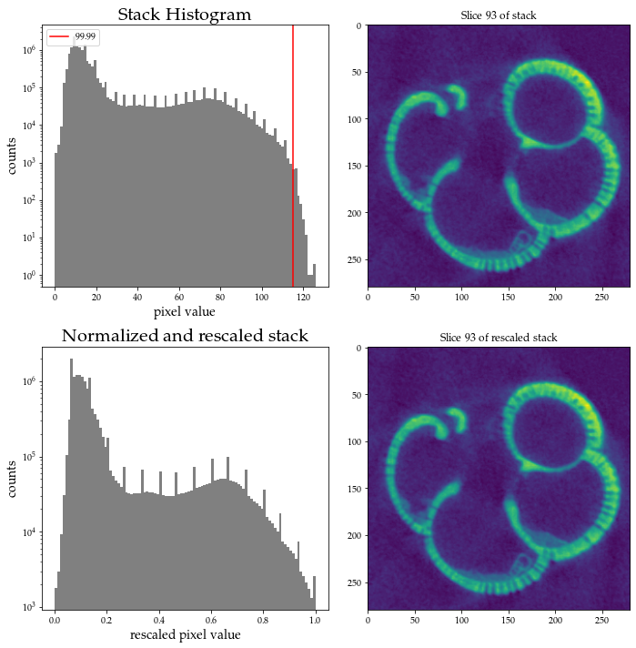
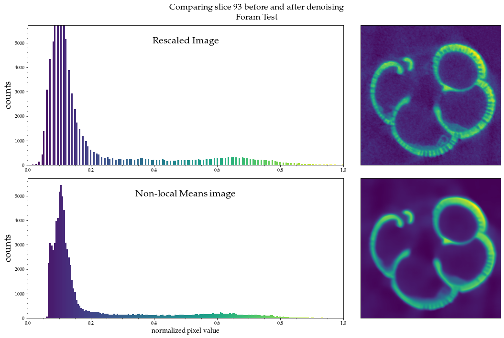
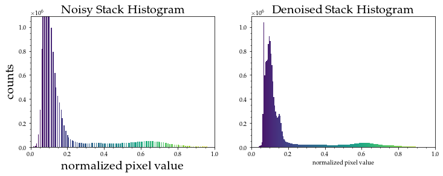
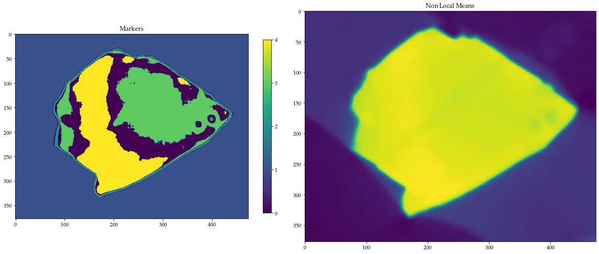
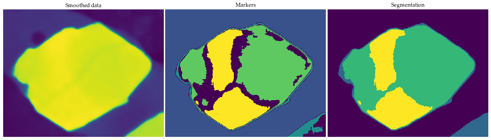

# Watershed based image segmentation of CT data
*Jordan Lubbers*  


*Oregon State University College of Earth, Ocean, and Atmospheric Sciences* 


**Last Updated:** 2/14/2021

# Overview
This notebook goes outlines how a small, yet powerful, python module, ```CTPy```, helps go from a stack of 2D tomographic images that represent a 3D volume to that same volume segmented into user defined regions based on their grayscale value. Built on top of [scikit-image](https://scikit-image.org/), the functions help the user achieve the following:


1. **load in stack of image files that represent slices through the dataset:** This is your 'raw' data

2. **Normalize the stack values between 0 and 1:** scikit image algorithms work better this way

3. **Apply contrast stretching:** This removes small, high attenuating areas that don't reflect the mineral (e.g. small oxide inclusions). Allows for us to see subtleties in mineral zone attenuation better.
    
4. **Denoise the data using a non-local means filter:** Creates more distinct histogram peaks while preserving textural information

5. **Choose the [markers](https://www.cmm.mines-paristech.fr/~beucher/wtshed.html) for the watershed segmentation algorithm:** These help prevent oversegmentation and more accurate image classification
6. **Apply [watershed algorithm](https://scikit-image.org/docs/dev/auto_examples/segmentation/plot_watershed.html) to entire stack:** Applies same markers for every image

7. **Save segmented stack to folder:** This is done as a consecutive series of 2D images similar to imageJ

For more information on each function just use the standard Python documentation for learning about a function:
```python
help(ct.import_stack)

```
```

    import_stack imports a stack of images and converts them into a 3D numpy 
    array so that it can be further processed using either numpy functions or
    scikit-image based functions in the CTPy functions in the module.
    
    import_stack(filepath,filetype,name):

    Parameters
    ----------
    filepath : string
        file directory for where the series of images is located. It is recommended
        that the files be in their own folder, as the function will import all 
        files from the directory as specified in the 'filetype' argument. 
    filetype : string
        type of file the images are. Choices are 'tif', 'png', or 'jpg'.
    name : string
        name of the dataset you are working with. This will be utilized for 
        figure labeling and filesaving functions later on.

    Returns
    -------
    stack : ndarray
        3D numpy ndarray where the first two dimensions pertain to an individual
        image (e.g., slice) in the dataset and the last dimension pertains to 
        the slice number in the stack. Since numpy arrays are in [rows,columns,depth]
        format, this is analagous to [y,x,z]

```


```python
# module of functions for CT data processing
import ctpy as ct


# array operations outside of CTPy
import numpy as np

# rescaling dataset
from skimage.transform import rescale, resize, downscale_local_mean

#tweaking figures outside of CTPy
import matplotlib.pyplot as plt

```

# Import your CT data
The first step in image processing is to actually bring in the stack of 2D images we will be working with. We do this utilizing the ```import_stack``` function from CTPy. The arguments for this function are the filepath to where the images are stored on your computer, the file type (e.g., tif, png, jpg), and the name you want to give the stack you are working with. This will get used for labeling throughout and also when saving your segmented stack. We establish the filepath to the images, the name of our dataset, and call the ```import_stack``` function. This will go through the chosen folder and import **all** files with the specified filetype, so it is recommended each dataset lives in its own folder. 


```python
# path to the folder where your 2D images reside
filepath = '/stack_tifs'

#For figure labeling and saving purposes
name = 'KNT8'

stack = ct.import_stack(filepath,'tif',name)
```


      0%|          | 0/484 [00:00<?, ?it/s]


    your stack is  484  images thick and is ready to denoise


## Rescale the stack
If your dataset is large, this is recommended that you downsample your data so that it can be processed further. Your data should be < (500 x 500 x 500) pixels 


```python
# stack = rescale(stack,.5,anti_aliasing = True)
```

# Normalize and rescale the data
Looking at our histogram on a log scale, we can see that there are a very small amount of pixels with values at the far high end of the attenuation range. Because it is <.01% of our data we are going to remove them to better fill the normalized range. This is known as contrast stretching and should allow us to see subtleties in our data better. We normalize the data because Python's sckit-image processing functions tend to work better with values between 0 and 1. To achieve this we call the ```rescale_stack``` function that takes arguments for the lower and upper bounds we want to trim off our data, the data we are working with, and the slice number we want to visualize:


```python
# number of images in a your stack
stack_length = len(stack)

# Choose an image in the middle of the stack to inspect
slice_number = int(stack_length/2)

# colormap for plotting throughout
cmap = 'viridis'

# call the rescale function
stack_rescale, stack_rescale_array1D, fig,ax = ct.rescale_stack(.000,99.99,
                                                        stack,
                                                        slice_number,
                                                        cmap
                                                       )

```


    

    


# Denoise the stack
In the figure above we can see that histogram peaks tend to have noise associated with them. While this noise can take a few different shapes (e.g., Gaussian), it is imperative we remove it so that we can more accurately segment the dataset. CTPy uses a [non local means](https://scikit-image.org/docs/dev/api/skimage.restoration.html?highlight=non%20local%20means#skimage.restoration.denoise_nl_means) denoising algorithm to remove noise from the data while still preserving crucial textural information. Here we call the ```denoise_stack``` function that takes arguments for the stack we want to smooth, the patch size, and patch distance of the non-local means filter. The larger these values are, the more blurred out the image will be, as it is using the values from more adjacent pixels to compute the value of a single pixel as it rasters across the image. 


```python
# call the non local means denoising helper function 
# and specify the patch size and distance
nlm_smooth, nlm_smooth1D = ct.denoise_stack(stack_rescale,10,10)
```


      0%|          | 0/484 [00:00<?, ?it/s]


    Your stack has been smoothed using the Skimage non-local means algorithm


## Compare denoised data with original (Slice)
Below we utilize the ```denoise_slice_plot``` function to visualize what the non-local-means filter is doing on a slice-by-slice basis. It takes arguments for the matplotlib [colormap](https://matplotlib.org/3.1.0/gallery/color/colorbar_basics.html) you would like to use for visualizing the data, the bins to include in the histogram, the slice number you want to visualize in the stack, the original and smoothed stacks you want to compare, and the name of the dataset you are working with. It can be seen that after non-local means denoising, histogram for the image has much more pronounced peaks and may even parse noisy peaks into multiple. We are now in a better position to segment the image.


```python
# bins for the histogram
bins = 200

fig, ax = ct.denoise_slice_plot(cmap,
                                bins,
                                slice_number,
                                stack_rescale,
                                nlm_smooth,
                                name
                               )
```


    

    


## Compare original and denoised data (Stack)
Similar to the ```denoise_slice_plot``` function, the ```denoise_stack_plot``` function will compare the raw data and denoised data, but this time it will incorporate the entire stack into the histogram. It takes arguments for the colormap, number of bins in the histogram, and the stacks you want to compare. We see that this also makes histograms much more pronounced and now allows us to train our watershed segmentation algorithm based on where the troughs in histogram data reside. 


```python
fig, ax = ct.denoise_stack_plot('viridis',
                                bins,
                                stack_rescale_array1D,
                                nlm_smooth1D
                               )
```


    

    


# Watershed segmentation
## Set markers


A brief blurb on the watershed algorithem from [Roerdink and Meijster, 2000](http://citeseerx.ist.psu.edu/viewdoc/download?doi=10.1.1.10.3852&rep=rep1&type=pdf):

"The watershed transform can be classified as a region-based segmentation approach. The intuitive idea underlying this method comes from geography: it is that of a landscape or topographic relief which is flooded by water, watersheds being the divide lines of the domains of attraction of rain falling over the region [46]. An alternative approach is to imagine the landscape being immersed in a lake, with holes pierced in local minima. Basins (also called ‘catchment basins’) will fill up with water starting at these local minima, and, at points where water coming from different basins would meet, dams are built. When the water level has reached the highest peak in the landscape, the process is stopped. As a result, the landscape is partitioned into regions or basins separated by dams, called watershed lines or simply watersheds."

Here is where you will define those local minima markers. Think of the algorithm starting at these markers and moving out from there, classifying the image not just by pixel value, but it's location relative to the markers. This makes it much more powerful and accurate than simple thresholding. Based on the histogram above you will determine the number of segments for your image (i.e. background, epoxy, crystal zone 1, crystal zone 2, melt inclusion). To set watershed markers, in brief, we create a new array that is the same shape as our stack, but fill it with 0s. We are then going to replace those 0s with 'marker' values for a certain pixel range. For example, if we think that all the normalized pixel values from 0 - 0.5 belong to a certain phase (i.e., background as is the case above), we fill the marker array with a value (e.g., 1). 

```python
markers[nlm_normal_array < 0.5] = 1
```

We then repeat this for as many distinct phases as we have evidence to believe exist in our data. Do not worry about being exact, as this is where the watershed algorithm can help! It will 'fill in' the unclassified values using pixel values as topography starting from the markers and moving outwards from there. 


```python
# Choose markers for your watershed algorithm. This is the 'starting point'
# for the algorithm and it will fill in the gaps of pixel values from there.

# establish new array in same shape as our smoothed stack but 0s. 
# We're going to fill in the indices of this new array with marker 
# values. The indices are based on where our nlm_normal_array meets 
# a given condition for the slice we defined above.
markers = np.zeros(nlm_smooth.shape, dtype=np.uint)

# set these based on your individual data. This example uses mineral data

# background
markers[nlm_smooth < 0.6] = 1

# volcanic glass
markers[np.logical_and(nlm_smooth >= .7, nlm_smooth < .85)] = 2

# mineral zone A
markers[np.logical_and(nlm_smooth >= .87, nlm_smooth < .9)] = 3

#mineral zone B
markers[nlm_smooth >= .915] = 4


fig, ax = ct.plot_markers(markers,
                          nlm_smooth,
                          150,
                          cmap
                         )
```


    

    


## Run watershed algorithm
Here we use the ```run_watershed_segmentation``` function to segment a given stack (e.g., our denoised stack) with a set of markers defined above. It will also display the runtime for this process, as it can take a few minutes with larger datasets.


```python
ws_results = ct.run_watershed_segmentation(nlm_smooth,markers)
```

    watershed runtime 238.17223501205444 seconds


## Display the watershed results
We can visualize the results of our segmentation for a single slice utilizing the ```plot_ws_results``` function. This will compare the denoised data, the markers, and the watershed segmentation results in a 1x3 panel. This function has arguments for the three stacks you are comparing, and the colormap you want to use to visualize them with. 


```python
fig, ax = ct.plot_ws_results(nlm_smooth,
                             markers,
                             ws_results,
                             slice_number,
                             cmap
                            )
```


    

    


# Export results
Similar to the ```import_stack``` function, the ```save_seg_results``` function will take each segmented 2D slice in your dataset and save it to a folder specified with the ```outpath``` variable. It takes arguments for the folder file path you want to save it to, the name of the dataset, and the stack of segmented data. 


```python
outpath = '/seg_results'
ct.save_seg_results(outpath,name,ws_results,cmap)
```


      0%|          | 0/484 [00:00<?, ?it/s]


```python
# save your work as a numpy array so it is easier to 
# load up and work with in the future
np.save('{}/{}_seg_results.npy'.format(outpath,name),
        ws_results
       )
```


